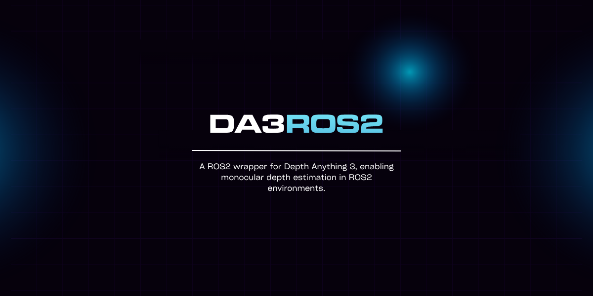

# Depth Anything 3 ROS2 Wrapper



A ROS2 wrapper for [Depth Anything 3](https://github.com/ByteDance-Seed/Depth-Anything-3), enabling monocular depth estimation in ROS2 environments.

## Features

- Real-time monocular depth estimation from RGB images
- Support for multiple Depth Anything 3 model variants (Small, Base, Large, Giant)
- GPU acceleration with CUDA support
- Configurable ROS2 topics and parameters
- Easy integration with existing ROS2 camera pipelines

## Requirements

- ROS2 (tested with Humble and later)
- Python >= 3.10
- PyTorch >= 2.0
- CUDA (optional, for GPU acceleration)

## Installation

### 1. Install Dependencies

```bash
# Install PyTorch (adjust for your CUDA version)
pip3 install torch torchvision --index-url https://download.pytorch.org/whl/cu118

# Install other Python dependencies
pip3 install -r requirements.txt
```

### 2. Install Depth Anything 3

```bash
pip3 install git+https://github.com/ByteDance-Seed/Depth-Anything-3.git
```

### 3. Build the ROS2 Package

```bash
# Navigate to your ROS2 workspace
cd ~/ros2_ws/src

# Clone this repository
git clone https://github.com/spectateursimon/Depth-Anything-3-ROS2.git

# Build the package
cd ~/ros2_ws
colcon build --packages-select depth_anything_3_ros2

# Source the workspace
source install/setup.bash
```

## Usage

### Basic Launch

Launch the node with default parameters:

```bash
ros2 launch depth_anything_3_ros2 default.launch.py
```

### Custom Parameters

You can override parameters at launch:

```bash
ros2 launch depth_anything_3_ros2 default.launch.py \
  image_topic:=/your/camera/image_raw \
  depth_image_topic:=/your/depth/output \
  device:=cuda:0 \
  model_name:=depth-anything/DA3-Large
```

### Run Node Directly

```bash
ros2 run depth_anything_3_ros2 depth_anything_node
```

## Configuration

### Parameters

| Parameter | Type | Default | Description |
|-----------|------|---------|-------------|
| `image_topic` | string | `/camera/color/image_raw` | Input RGB image topic |
| `depth_image_topic` | string | `/depth` | Output depth image topic |
| `device` | string | `cuda:0` | Device for inference (`cuda:0`, `cuda:1`, `cpu`) |
| `model_name` | string | `depth-anything/DA3-Large` | Model variant to use |

### Available Models

The following Depth Anything 3 models are available:

- `depth-anything/DA3-Small` (80M parameters) - Fastest
- `depth-anything/DA3-Base` (120M parameters) - Balanced
- `depth-anything/DA3-Large` (350M parameters) - High quality (default)
- `depth-anything/DA3-Giant` (1.15B parameters) - Best quality
- `depth-anything/DA3Metric-Large` - Metric depth estimation

### Configuration File

Edit `config/default.yaml` to set default parameters:

```yaml
depth_anything_3:
  ros__parameters:
    image_topic: "/camera/color/image_raw"
    depth_image_topic: "/depth"
    device: "cuda:0"
    model_name: "depth-anything/DA3-Large"
```

## Topics

### Subscribed Topics

- `image_topic` (`sensor_msgs/Image`): Input RGB image stream

### Published Topics

- `depth_image_topic` (`sensor_msgs/Image`): Output depth image (16-bit grayscale)

## Example with RealSense Camera

```bash
# Terminal 1: Start RealSense camera
ros2 launch realsense2_camera rs_launch.py

# Terminal 2: Start Depth Anything 3
ros2 launch depth_anything_3_ros2 default.launch.py \
  image_topic:=/camera/camera/color/image_raw
```

## Visualization

View the depth output using RViz2:

```bash
rviz2
```

Add an Image display and set the topic to `/depth` (or your configured output topic).

Alternatively, use `rqt_image_view`:

```bash
ros2 run rqt_image_view rqt_image_view
```

## Performance

Performance varies by model size and hardware:

| Model | Parameters | GPU Memory | FPS (RTX 3090) |
|-------|-----------|------------|----------------|
| DA3-Small | 80M | ~2GB | ~45 FPS |
| DA3-Base | 120M | ~3GB | ~35 FPS |
| DA3-Large | 350M | ~5GB | ~25 FPS |
| DA3-Giant | 1.15B | ~12GB | ~10 FPS |

*Note: Performance may vary based on input resolution and hardware configuration.*

## Troubleshooting

### CUDA Out of Memory

If you encounter CUDA out of memory errors, try:
- Using a smaller model (`DA3-Small` or `DA3-Base`)
- Reducing input image resolution
- Using CPU inference (slower): `device:=cpu`

### Model Download Issues

Models are automatically downloaded from Hugging Face Hub on first run. If download fails:
- Check your internet connection
- Ensure you have sufficient disk space (~5GB per model)
- Try running with `HF_HUB_OFFLINE=0` environment variable

## License

This project is licensed under the Apache License 2.0 - see the [LICENSE](LICENSE) file for details.

The original Depth Anything 3 is also licensed under Apache 2.0.

## Acknowledgments

- [Depth Anything 3](https://github.com/ByteDance-Seed/Depth-Anything-3) by ByteDance
- ROS2 community

## Citation

If you use this work in your research, please cite the original Depth Anything 3 paper:

```bibtex
@article{depthanything3,
  title={Depth Anything 3: Toward a Unified Framework for Monocular Depth Estimation},
  author={Yang, Lihe and others},
  journal={arXiv preprint},
  year={2024}
}
```

## Contributing

Contributions are welcome! Please feel free to submit a Pull Request.

## Contact

For issues and questions, please open an issue on [GitHub](https://github.com/spectateursimon/Depth-Anything-3-ROS2/issues).
